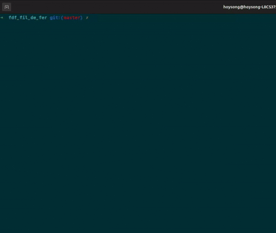

# FdF

[English](./README.md) | [한국어](./README.ko.md)

C와 MiniLibX로 구현한 와이어프레임 지형 시각화 프로그램입니다.  
직사각형 `.fdf` 파일에서 높이와 색상 데이터를 읽고, 화면 좌표로 투영한 뒤 인접한 점을 색상이 보간된 선분으로 연결합니다.



## 1. 주요 기능

- `.fdf` 파일의 직사각형 높이 맵 파싱
- 각 점의 선택적 16진수 색상 처리
- 맵 좌표를 화면 좌표로 변환하는 고정 아이소메트릭 방식의 투영
- 투영 결과가 1000 × 800 창을 벗어날 때 축소 비율 적용
- Bresenham 알고리즘을 이용한 가로·세로 인접점 선분 렌더링
- 선분의 시작점과 끝점 사이 RGB 색상 보간
- 인자 개수, 확장자, 파일 열기, 직사각형 맵 형태 검증
- `Esc` 종료 시 할당한 자원 해제

## 2. 렌더링 처리 과정

맵 데이터 처리와 픽셀 렌더링은 다음 순서로 진행됩니다.

1. `get_next_line`으로 파일을 한 줄씩 읽습니다.
2. 각 행을 높이·색상 토큰으로 분리합니다.
3. 모든 행의 점 개수가 같은지 검사합니다.
4. 토큰을 2차원 점 배열로 변환합니다.
5. 투영을 적용하고 음수 좌표를 화면에 표시되는 영역으로 이동합니다.
6. 투영 결과가 창 크기를 넘으면 전체 좌표에 축소 비율을 적용합니다.
7. 각 점을 오른쪽 및 아래쪽 인접점과 연결합니다.
8. 계산한 픽셀을 MiniLibX 이미지 버퍼에 기록하고 완성된 이미지를 창에 표시합니다.

## 3. 핵심 구현

### 맵 파싱

각 토큰을 맵상의 위치, 높이, 색상을 가지는 점으로 변환합니다.  
색상이 생략된 점에는 흰색(`0xFFFFFF`)을 적용합니다.

### 투영과 크기 조정

맵 좌표를 45도 회전하고, 높이 값을 투영된 세로 좌표에 반영한 뒤 출력 크기에 맞게 배율을 적용합니다. 투영 결과가 음수인 좌표는 화면 안으로 이동시키며, 고정된 창보다 큰 경우 공통 축소 비율을 적용합니다.

### 선분과 색상 렌더링

x축 변화가 큰 선분과 y축 변화가 큰 선분을 나누어 Bresenham 알고리즘으로 그립니다. 선분을 구성하는 각 픽셀의 RGB 값은 시작점에서 끝점까지의 진행 거리를 기준으로 보간합니다.

계산한 픽셀은 MiniLibX 이미지 버퍼에 직접 기록하고, 완성된 이미지를 한 번에 창으로 전송합니다.

## 4. 실행 환경

이 프로젝트는 Linux와 X11 환경을 대상으로 합니다.

필요한 도구와 라이브러리:

- C 컴파일러(`cc`)
- `make`
- X11 및 Xext 개발 라이브러리
- zlib 및 BSD 호환 라이브러리
- `minilibx-linux`에 포함된 MiniLibX
- `src_files/my_libft`에 포함된 자체 Libft

Ubuntu 또는 Debian 계열에서는 다음과 같이 의존성을 설치할 수 있습니다.

```bash
sudo apt update
sudo apt install build-essential libx11-dev libxext-dev zlib1g-dev libbsd-dev
```

## 5. 빌드

```bash
git clone https://github.com/hoysong/fdf_fil_de_fer.git
cd fdf_fil_de_fer
make -C minilibx-linux
make
```

빌드가 완료되면 `fdf` 실행 파일이 생성됩니다.

생성된 파일을 정리하려면 다음 명령을 사용합니다.

```bash
make clean
make fclean
make re
```

## 6. 실행

하나의 `.fdf` 맵 파일을 인자로 전달합니다.

```bash
./fdf test_maps/42.fdf
```

저장소에 포함된 다른 예시:

```bash
./fdf test_maps/pylone.fdf
./fdf test_maps/mars.fdf
./fdf test_maps/elem-col.fdf
```

## 7. 조작 방법

| 입력 | 동작 |
| --- | --- |
| `Esc` | 할당한 자원을 해제하고 프로그램 종료 |

## 8. 맵 파일 형식

맵은 공백으로 구분된 높이 값으로 구성되며 한 줄이 하나의 행을 나타냅니다. 모든 행은 같은 개수의 점을 가져야 합니다.

```text
0  0  0  0
0  5  5  0
0  5 10  0
0  0  0  0
```

각 점에는 쉼표 뒤에 16진수 RGB 색상을 선택적으로 지정할 수 있습니다.

```text
0,0xFFFFFF  0,0x00FFFF  0,0xFFFFFF
0,0xFFFF00  8,0xFF0000  0,0x0000FF
0,0xFFFFFF  0,0x00FF00  0,0xFFFFFF
```

토큰 형식:

```text
높이
높이,0xRRGGBB
```

높이는 양수와 음수 정수를 사용할 수 있습니다. 색상을 생략한 점은 흰색으로 렌더링됩니다.

## 9. 프로젝트 구조

```text
.
├── 01_main.c                  # 입력 검증, MiniLibX 설정, 이벤트 루프
├── 02_get_parsed_data.c       # 파일 읽기, 토큰 분리, 맵 형태 검증
├── 03_splits_to_points.c      # 높이·색상 변환 및 점 생성
├── 04_iso_prjc.c              # 투영 및 좌표 이동
├── 05_adjust_scale.c          # 큰 투영 결과의 축소
├── 06_draw_line.c             # 인접점 순회 및 Bresenham 선분 생성
├── 07_put_pixel.c             # 선분 진행률 계산 및 색상 보간
├── 08_put_pixel.c             # RGB 채널별 보간
├── 09_free_data.c             # 파싱 데이터 해제
├── 99_my_mlx_pixel_put.c      # 이미지 버퍼에 픽셀 직접 기록
├── my_fdf.h                   # 상수, 구조체, 함수 선언
├── test_maps                  # FdF 예제 맵
├── src_files/my_libft         # 자체 C 유틸리티 라이브러리
├── minilibx-linux             # 그래픽 라이브러리
└── video.gif                  # 실행 화면
```

## 10. 기술적 학습 내용

이 프로젝트를 통해 다음 내용을 직접 구현하고 확인했습니다.

- 구조화된 텍스트 입력을 동적 할당 데이터로 변환하는 과정
- 좌표의 회전, 투영, 이동, 크기 조정
- 고수준 그래픽 API 없이 선분을 픽셀 단위로 생성하는 방법
- 선분 위의 위치에 따른 RGB 값 보간
- 이미지 버퍼를 이용한 렌더링과 그래픽 자원 관리
